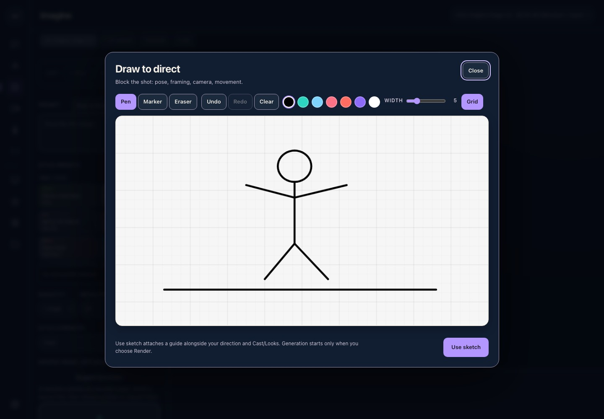

# dork

The free, open-source **Flask edition of Dork Director**, running locally with a browser interface. Its directing workflow turns a brief or source image, your taste, and selected Cast/Looks into structured still/motion direction, variations and shot-list prompts. Chat can drive media actions, and contextual Live Voice can propose directions for your approval.

**Scope of this release:** v0.1.1 updates the older Flask workspace. It does not include the newer native studio's persistent projects/worlds, take lineage, Stage/Compare/Storyboard workspaces, continuity evaluation or portable production bundles. Its video continuation uses a frozen frame plus a short in-session narrative; it does not retain a project-level sequence across restarts.

**The app is free. AI generation uses your own paid provider account.** The local editor, drawing pad and saved library work without an API key. Grok renders, chat, prompt inference, speech and cloud Collections require an internet connection and are billed by xAI; optional OpenAI tools use your OpenAI account. No account with dork or Flint is required.



## Start on macOS

This release is the recovered Flask desktop app with browser UI and desktop launchers. It requires Python 3.10 or newer; it is not a self-contained native binary.

1. Download and unzip the source release.
2. Run **Setup dork.command** once. It creates a local Python environment and installs the pinned, open-source dependencies from PyPI. It does not download AI models.
3. Run **Launch dork.command**. Chrome or Edge opens an app window, or your default browser opens the studio. The launcher prints its local URL.
4. Open **Settings** to enter your own provider key when you want to use AI features.

If double-clicking a launcher is unavailable, open Terminal in the extracted folder and run:

```sh
zsh 'Setup dork.command'
zsh 'Launch dork.command'
```

Keep the launcher terminal open while using dork; press Ctrl-C there to quit. Your preferred local port is stable for your username in the range 5357–5456. The launcher uses one free-port fallback only if that port is occupied, leaving existing processes running. Permission and other socket errors stop the launch. To choose a port explicitly:

```sh
.venv/bin/python app/dashboard.py --open --port 5358
```

Windows and Linux can use `python -m venv .venv`, install `requirements.txt` with that environment, and run `app/dashboard.py --open --port 5357`. Those platforms have not been tested in this release.

## Create

- **Draw to direct:** pen, translucent marker, whole-stroke eraser, color and width controls, undo/redo and a display grid. Use sketch attaches a composition guide; it does not submit a render. An existing source image is retained beside the guide on a local reference board.
- **Cast and Looks:** keep character and style references in your local asset library, then attach selected references to your image or video direction.
- **Suggest directions:** request three image-edit or motion pitches with the selected source, brief, taste, Cast/Looks and recent in-session scenes. Opening the card is local; requesting AI pitches is explicitly provider-billed. Choosing a pitch stages editable direction for your review before Generate.
- **Imagine:** current Grok Imagine Image 2.0, explicit Low/Medium quality, 1K/1.5K/2K and up to ten outputs. Low is the default.
- **Video:** Grok Imagine Video 1.5 Lite (**Fast**) is the default; Video 1.5 (**Quality**) and Classic remain selectable. Fast and Quality support 480p/720p/1080p, 1–15 second requests and image-to-video. Classic is limited to 480p/720p here.
- **Desktop workflow:** Director, chat, image editing, local galleries, speech controls, code/artifact previews, skills and provider Collections are retained from the original app. Artifact scripts run in an isolated preview that blocks network access.

The original Flask Director/Chat/Live Voice workflow is retained. Image-to-Video/Edit attaches directly; **Suggest directions** restores the creative pitch entry through an explicit paid request. Director source upload also attaches locally, with paid inference available separately. The Video source retains its explicit narrative-aware Suggest action. Local state is isolated; see [optional selected-data import](IMPORT_LOCAL_DATA.md) to bring chosen media, references or direction text across yourself. External-network-dependent artifacts cannot run inside the restricted preview.

For sketch-directed video, first render a finished still in Imagine, then use its **Video** button. A sketch guides layout rather than becoming the literal opening frame. Both renders are billed separately. Video with active Cast/Looks also prepares a paid finished still before animating; the Video estimate includes both steps. Last-frame continuation starts a new paid image-to-video request; this app does not implement the provider's video editing or extension APIs.

## Cost and privacy

The current default is Fast, 6 seconds, 720p: estimated **$0.18 USD**, or **$0.19** with an input image. Quality at the same settings is **$0.84/$0.85**. An Image 2.0 Low 2K still is **$0.06**, plus **$0.01** per input image per output. Current estimates are shown before the media Generate button and are based on xAI pricing checked on 2026-10-02. Your account terms, rates and actual served outputs determine your final bill. Review [xAI pricing](https://docs.x.ai/developers/pricing).

Provider actions send the selected prompt and inputs to the selected provider. Chat can invoke media actions through the studio's action tags; chat, Smart/Infer/Suggest, voice and cloud Collections can incur their own provider charges. The media estimate does not cover those other actions. Paid media submissions are not automatically retried; a failure requires another explicit action.

Local state is stored under `~/.dork-studio`. Browser preferences/drafts use local browser storage. Provider keys entered in Settings are stored in a local JSON file with mode `600`, not in an encrypted keychain. The UI reports configured status without showing key fragments. Environment keys or an optional `.env` in this new release folder can also be used. Older app state and credentials are never imported automatically. `DORK_STATE_HOME` selects an alternate state directory; `DORK_NO_ENV=1` ignores the release `.env`.

The server binds only to `127.0.0.1`, rejects non-local Host values and cross-site origins, and runs without debug mode. Do not expose it to the internet. This release contains no provider keys, private media, model weights, original Git history, analytics or dork account service.

Optional `ffmpeg` and `ffprobe` must be available on PATH for last-frame extraction and stitching. They are not bundled. Basic drawing, libraries and browser frame capture do not require them.

## Verification

Tested on macOS with an Apple M3 Max, Python 3.13 and the pinned dependencies. Thirty-seven Python tests cover local privacy boundaries, mocked provider payloads/costs/job states and launcher behavior. Twenty Node tests cover drawing, media handoff, explicit three-direction pitches and artifact preview isolation. A real local browser walkthrough with empty keys, temporary state and a synthetic provider checked sketch → Director source → three pitches → editable direction, without a media submission. The drawing component passed fifteen browser assertions, and artifact rendering/isolation passed nineteen. Loopback binding and collision fallback were checked with real local sockets; Chrome/Edge invocation is covered by mocked command checks.

**No paid provider render was made for this release.** Render quality, current account-specific access, live voice/Collections behavior and cross-platform launch remain unverified. The M3 Max runs the UI and local media tools; xAI performs the generative inference in the cloud. No local model or GPU benchmark is claimed.

Run the reproducible tests:

```sh
.venv/bin/python -m unittest discover -s tests -p 'test_*.py' -v
node --test tests/*.cjs
```

Build an allowlisted source archive:

```sh
python3 scripts/package_release.py
```

## License

[dork source is MIT licensed](LICENSE). See [third-party notices](THIRD_PARTY_NOTICES.md) and `LICENSES/` for dependency rights. Provider models and services are separate products governed by their own terms; this license does not cover them. No face-swap weights or third-party trained models are distributed.
